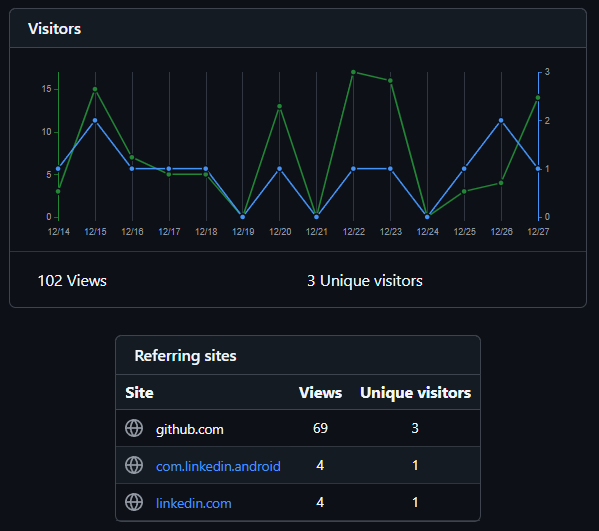

# Github Dashboard 


Author: [Andrew Gyakobo](https://github.com/Gyakobo)

## Introduction

This project showcases a Dashboard that displays multiple repos and their number of views 

## Methodology

Before we start delving into progam let's first figure out how to run the script: [main.py](https://github.com/Gyakobo/github-repo-dashboard/blob/main/main.py).

>[!NOTE]
>Don't forget to also setup the [config.txt](https://github.com/Gyakobo/github-repo-dashboard/blob/main/config.txt) file with your user credentials(username and token).

The program would further go through all of your repositories and display the following setup:



```shell
Repository: quadtree-image-compression
Views: 102 | Unique Views: 3
Repository: quadtree-image-compression
Date       | Views | Uniques
------------------------------
2024-12-14 |     3 |       1
2024-12-15 |    15 |       2
2024-12-16 |     7 |       1
2024-12-17 |     5 |       1
2024-12-18 |     5 |       1
2024-12-20 |    13 |       1
2024-12-22 |    17 |       1
2024-12-23 |    16 |       1
2024-12-25 |     3 |       1
2024-12-26 |     4 |       2
2024-12-27 |    14 |       1
------------------------------
Top Referrers:
Source               | Views | Uniques
----------------------------------------
github.com           |    69 |       3
com.linkedin.android |     4 |       1
linkedin.com         |     4 |       1
----------------------------------------
```

If you happen to have no views at all, you'd be shown the following:

```shell
Repository: anchor
Views: 0 | Unique Views: 0
No views
No referrer data available for anchor.
```


